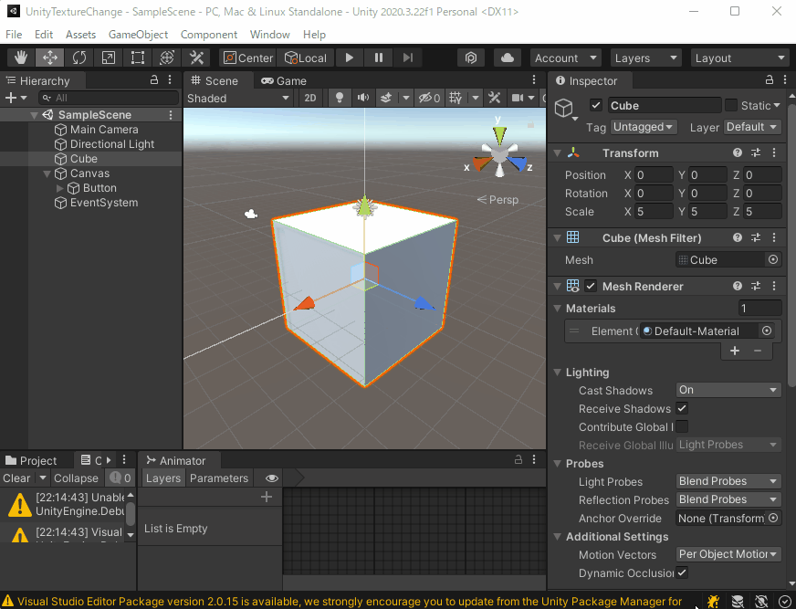

# テクスチャ画像の動的張替え

Unityでテクスチャ画像の動的張替えを行う処理を実装したので、掲載する。

## 1. 外部ファイルを取り込む場合

### 出来上がりイメージ




### コード詳細

Cube（四角）オブジェクトの処理
``` csharp
public class CureUpdate : MonoBehaviour
{
    // Update is called once per frame
    void Update()
    {
        // 定周期で自動回転
        transform.Rotate(new Vector3(0.2f, 0.2f, 0));
    }
}
```

ボタンクリック時の処理

``` cSharp
public class ButtonEvent : MonoBehaviour
{
    public void OnClick()
    {
        // ファイル選択ダイアログ表示
        var path = EditorUtility.OpenFilePanelWithFilters("Open Texture Image File", "", new[]{"Texture Image", "png,jpg,jped,bmp"});

        // 画像ファイル読み込み。バイト配列へ。
        byte[] bytes = File.ReadAllBytes(path);

        // テクスチャオブジェクト生成（サイズ2×2は後で自動的に更新されるらしい）
        Texture2D texture = new Texture2D(2, 2);

        // バイト配列からテクスチャをロード
        texture.LoadImage(bytes);

        // 貼り付け対象オブジェクトを取得
        GameObject cubeObject = GameObject.Find("Cube");

        // 対象のRenderere.material.mainTextureを置き換える。
        Renderer cubeRenderer = cubeObject.GetComponent<Renderer>();
        cubeRenderer.material.mainTexture = texture;
    }
}

```

## 2. Assets取込み済の画像を取り込む場合

### 事前準備

- Assets下に「Resources」フォルダを作成しそこに画像ファイルを配置  

  

- 各画像ファイルのInspctorで、Advanced →「Read/Write Enabled」をチェックする  

  

### 出来上がりイメージ


### コード詳細

``` csharp
public class ButtonEventJT : MonoBehaviour
{

    public void OnClick()
    {
        // テクスチャをResourcesから読み込む
        Texture2D tx2d = Resources.Load("Stone 1 FULL", typeof(Texture2D)) as Texture2D;

        // 対象オブジェクトにテクスチャを設定
        GameObject.Find("Cube").GetComponent<Renderer>().material.mainTexture = tx2d;
    }
}

```

## 参考
- テクスチャ張替えの方法  
[Unity+AssetStoreおすすめ情報 Unity：byte配列からjpg/pngをテクスチャ(Texture)に変換](https://www.fast-system.jp/unity%ef%bc%9abyte%e9%85%8d%e5%88%97%e3%81%8b%e3%82%89jpg-png%e3%82%92%e3%83%86%e3%82%af%e3%82%b9%e3%83%81%e3%83%a3texture%e3%81%ab%e5%a4%89%e6%8f%9b/)
- Buttonオブジェクト操作・設定  
[Your 3D 【Unity】Button(ボタン)の使い方を詳しく解説!!](https://your-3d.com/unity-button-use/)
- ファイル選択ダイアログ  
[うにてぃブログ 【Unity】Unity で使えるフォルダ・ファイル選択パネル](https://hacchi-man.hatenablog.com/entry/2020/01/21/220000#EditorUtilityOpenFilePanelWithFilters)
